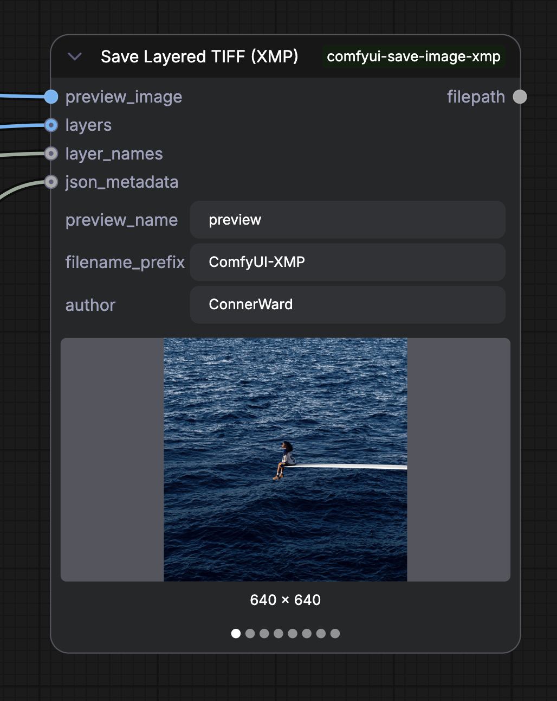
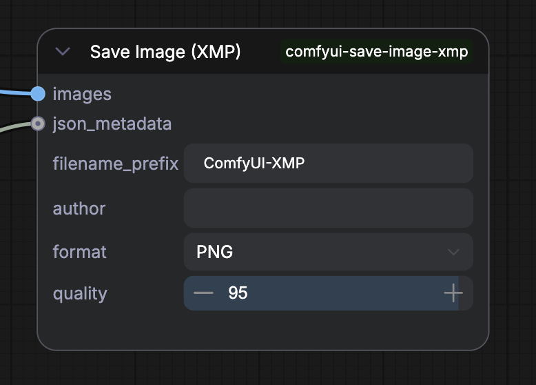

# ComfyUI Save Layered Image with Metadata!

Stop keeping track of so many files. 

Save layered TIFFs and flat images (Webp, PNG, JPEG) from ComfyUI with XMP metadata burned into the file — the workflow graph, prompts, model SHA256 hashes, and any arbitrary JSON embedded per-file.

---

## Save Layered TIFF (XMP)



Saves a multi-page TIFF where each page is a named layer. XMP metadata is embedded on page 0. Previews all layers in the node UI.

| Input | Type | Description |
|---|---|---|
| `preview_image` | IMAGE | Page 0 / thumbnail layer |
| `layers` | IMAGE | Additional layers (list) |
| `layer_names` | STRING | Names aligned to `layers` (list) |
| `json_metadata` | STRING | Optional JSON to embed in `cfl:extra` |
| `preview_name` | STRING | Name for the preview layer |
| `filename_prefix` | STRING | Output filename prefix |
| `author` | STRING | Author name embedded in XMP |

Returns the output `filepath` as a STRING for downstream nodes.

> macOS QuickLook, Finder thumbnails, and Preview.app all render the TIFF natively (Deflate/ZIP compression).

---

## Save Image (XMP)



Saves a single image as **PNG**, **WEBP**, or **JPEG** with XMP metadata embedded inline.

| Input | Type | Description |
|---|---|---|
| `images` | IMAGE | Image batch to save |
| `json_metadata` | STRING | Optional JSON to embed in `cfl:extra` |
| `filename_prefix` | STRING | Output filename prefix |
| `author` | STRING | Author name embedded in XMP |
| `format` | PNG/WEBP/JPEG | Output format |
| `quality` | INT | Quality for lossy formats (1–100) |

PNG files also get `workflow` and `prompt` tEXt chunks for native ComfyUI workflow reload.

---

## XMP fields

All saved files embed a custom XMP block:

| Field | Content |
|---|---|
| `cfl:workflow` | Full ComfyUI node graph JSON |
| `cfl:prompt` | Execution prompt graph JSON |
| `cfl:models` | SHA256 hashes of all model files used |
| `cfl:extra` | Arbitrary JSON from `json_metadata` input |
| `cfl:author` | Author string |
| `cfl:layers` | Comma-separated layer names (TIFF only) |

Model hashes are collected automatically from the run graph and cached per session.

---

## Why TIFF?

Most AI image outputs are saved as flat PNGs or JPEGs — one image, one file. When a pipeline produces multiple meaningful outputs (inpainting mask, outpainted region, heatmaps, composites), you either flood a folder with files or lose the intermediate layers entirely.

TIFF is the only widely-supported lossless format that natively handles multiple named layers in a single file — the same reason it has been the standard archival format in print, broadcast, and medical imaging for decades.

**Per-layer compression.** TIFF stores each page in its own Image File Directory (IFD), and each IFD carries its own compression tag. This means different layers can use different schemes in the same file — a preview layer at JPEG quality 90, mask layers at lossless Deflate, a float32 heatmap at uncompressed. Current nodes use Deflate/ZIP + delta predictor uniformly (~30–50% smaller than uncompressed), with full bit-depth preservation and no quality loss.

**Multi-layer, single file.** Each page carries a `PageName` tag (TIFF tag 285) used as the layer name. One file = one complete output set. No zip archives, no naming conventions to maintain.

**Opens natively in Photoshop and Affinity Photo as layers.** Drop the TIFF into Photoshop — each page appears as a separate layer in the Layers panel, named. Same in Affinity Photo, GIMP (via TIFF import), and darktable. This is a TIFF standard behavior, not a plugin requirement.

**macOS native rendering.** Finder thumbnails, QuickLook spacebar preview, and Preview.app all decode the file without any third-party software.

**XMP survives the round-trip.** The full ComfyUI workflow JSON, model hashes, and any custom metadata travel with the file through Photoshop, file systems, and archives — readable by `exiftool`, Lightroom, and any XMP-aware tool.

---

## Install

```bash
cd ComfyUI/custom_nodes
git clone https://github.com/connerkward/comfyui-save-image-xmp.git
pip install tifffile
```

Or via ComfyUI Manager: search `comfyui-save-image-xmp`.
